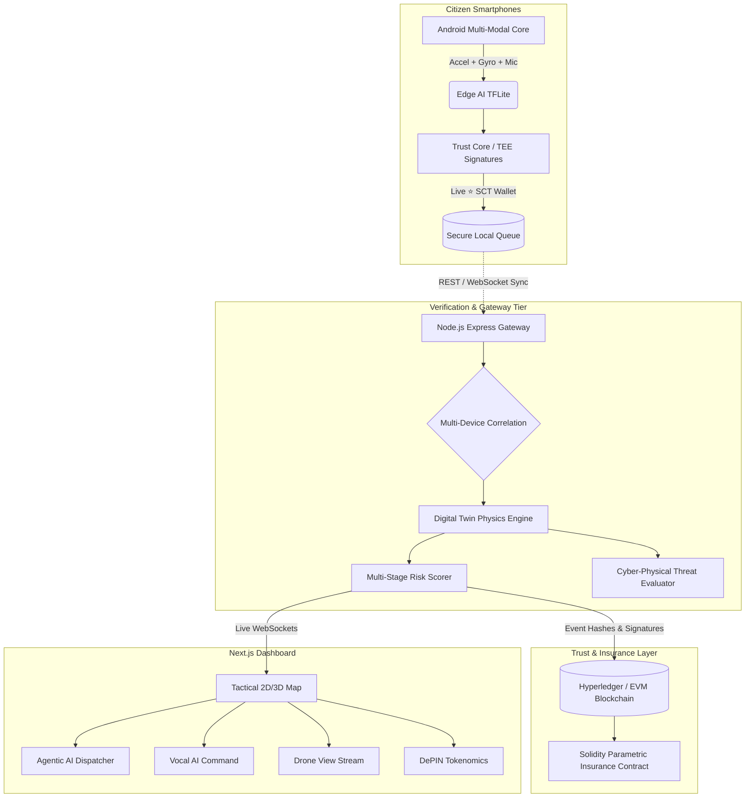

# Blockchain-Verified Citizen Sensor Network (SIH26223)


An enterprise-grade, decentralized disaster early warning and structural health monitoring system. This platform transforms ordinary smartphones into a cryptographically secure, offline-first universal sensor network capable of delivering validated, tamper-proof early warnings for natural catastrophes, structural fatigue, and cyber-physical infrastructure attacks.

---

## 🌪️ Supported Disaster Profiles

Using multi-modal kinetic physics (accelerometers, gyroscopes, barometers, and acoustic microphone fusion), the system acts as a universal early warning grid:
* **Natural Disasters (Earthquakes & Tsunamis):** Detects low-frequency seismic resonance (0.5Hz–5.0Hz), triggering early warning cascades and coastal evacuation protocols.
* **Cyber-Physical Threat & SCADA Tampering:** Detects erratic high-frequency physical vibrations that deviate from natural resonant frequencies ($\text{correlation} < 0.4$), flagging state-sponsored damping system hacks.
* **Structural Health & Crack Fatigue (Bridge/Building Collapse):** Combines accelerometer vector magnitudes with ambient acoustic microphone monitoring to detect micro-cracks before catastrophic failure.
* **Artificial Disasters (Explosions & Shockwaves):** Captures instantaneous high-g shockwaves and barometric pressure spikes.
* **Environmental Hazards (Landslides & Avalanches):** Detects rapid elevation drops combined with erratic tumbling to alert first responders.

---

## 🌟 Core Features & Live Innovations

### 🤖 1. Agentic AI Autonomous Dispatcher
* **Multi-Agent Swarm Orchestration:** An autonomous agentic pipeline featuring **Structural Diagnostic Agents**, **Emergency Medical Dispatchers**, and **Drone Flight Path Navigators**.
* **Live Command Execution:** Automatically triages multi-sensor alerts, calculates structural collapse probability, and dispatches municipal assets without human delay.

### 🎙️ 2. Vocal AI Command Center
* **Hands-Free Dashboard Navigation:** Integrated Web Speech AI enabling real-time voice commands:
  * *"Show me the Tactical Map"*
  * *"Open the 3D Digital Twin"*
  * *"Show me the Blockchain Ledger"*
  * *"Open Citizen Tokenomics"*
  * *"Launch Drone View"*

### 🪙 3. Citizen Reward Token Economy (DePIN Gamification)
* **Decentralized Infrastructure Incentives:** Citizens earn **⭐ Sensor Data Tokens (SCT)** in real time for contributing background edge-sensor telemetry.
* **Edge Wallet & Analytics:** Features an active token balance wallet in the Android mobile application and a comprehensive macroeconomic telemetry portal in the web dashboard.

### 🛡️ 4. Cyber-Physical Threat Matrix
* **Finite Element Digital Twin Verification:** Backend physics engine compares live sensor vibration spectra against hardcoded structural resonant baselines (e.g., 2.4Hz for urban bridges).
* **Tamper Identification:** If vibration profiles indicate physical impossibility for natural earthquakes, the Evidence Room immediately flags a **"CYBER-PHYSICAL THREAT DETECTED"** warning.

### 🚁 5. Autonomous Drone Dispatch & Real-Time Telemetry
* **Live Aerial Reconnaissance:** Real-time drone stream feeds integrated into the dashboard, providing live HD feeds, battery monitoring, and automated flight vectoring to disaster epicenter coordinates.

### ⚡ 6. Parametric Micro-Insurance Smart Contracts
* **Instant Disaster Relief:** EVM-compatible Solidity smart contracts (`ParametricInsurance.sol`) anchored to the blockchain. Instantly releases micro-relief funds directly to affected citizens when multi-sensor consensus risk scores cross pre-defined thresholds.

---

## 🏗️ System Architecture



---

## 📂 Project Structure

```
├── android/                   # Native Android Mobile Sensing Application
│   ├── app/src/main/java/     # MainActivity, GatewaySyncManager (Edge AI & SCT Wallet)
│   └── app/src/main/res/      # Mobile UI Layouts & Vector Assets
├── backend-gateway/           # Node.js Ingestion & Digital Twin Backend
│   ├── src/server.js          # Express Gateway & WebSocket Broadcaster
│   ├── src/digitalTwin.js     # Physics Engine & Cyber-Physical Threat Detection
│   └── src/mockDatabase.js    # In-Memory Event & Risk Storage
├── blockchain/                # Smart Contracts & Ledger Verification
│   └── contracts/             # ParametricInsurance.sol & Access Control
├── my-app/                    # Next.js 15 Command Center (Dashboard)
│   ├── app/page.tsx           # Full Interactive Command Center UI
│   ├── app/layout.tsx         # Global Providers & Typography
│   └── public/                # Static Media & Map Assets
└── README.md                  # Project Documentation
```

---

## 🚀 Getting Started

### Prerequisites
* **Node.js:** v18+ and `npm`
* **Android Studio:** Ladybug or newer (for mobile build)
* **Browser:** Chrome/Edge recommended for Web Speech API support

### 1. Launch the Backend Gateway
```bash
cd backend-gateway
npm install
node src/server.js
```
*Backend server runs on `http://localhost:4000`.*

### 2. Launch the Next.js Authority Dashboard
```bash
cd my-app
npm install
npm run dev
```
*Open `http://localhost:3000` in your web browser.*

### 3. Run the Mobile Sensor App
1. Open the `/android` directory in Android Studio.
2. Click **Sync Project with Gradle Files**.
3. Run the application on an Android device or emulator.
4. Tap **"START SENSING"** to stream kinetic physics data and earn live ⭐ SCT Tokens.

---

## 🔒 Security & Privacy

* **Zero-Trust Chain of Custody:** Smartphone hardware TEE cryptographically signs vibration telemetry at source.
* **Pseudonymous Data Privacy:** No Personally Identifiable Information (PII) is transmitted; devices are identified via salted hardware hashes.
* **Tamper-Proof Audit Trail:** Critical disaster thresholds trigger immutable hashes committed to the smart contract ledger.

---

## 🤝 Team & Hackathon Information
Developed for **Smart India Hackathon (SIH) 2026** under Problem Statement **SIH26206**.

