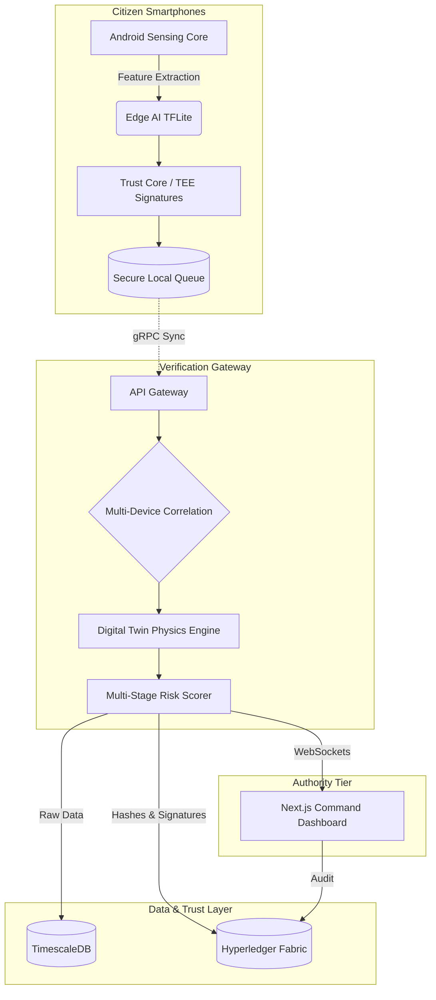

# Blockchain-Verified Citizen Sensor Network (SIH26223)


An enterprise-grade, decentralized disaster early warning system designed to protect all citizens. This platform transforms ordinary smartphones into a cryptographically secure, offline-first universal sensor network capable of delivering validated, tamper-proof early warnings for both natural and artificial disasters, ensuring safety and rapid response for everyone.

### 🌪️ Supported Disaster Profiles
Because this system relies on kinetic physics (accelerometers, gyroscopes, barometers, and microphones), it acts as a universal early warning grid protecting against both natural and man-made catastrophes:
*   **Natural Disasters (Earthquakes & Tsunamis):** Detects fatal low-frequency seismic resonance, triggering early warnings and coastal evacuation protocols before waves hit.
*   **Artificial Disasters (Explosions & Bomb Blasts):** Detects instantaneous, violent shockwaves from industrial accidents or targeted attacks.
*   **Structural Failures (Bridge/Building Collapse):** Identifies building shear and metal fatigue before catastrophic failure occurs.
*   **Environmental Hazards (Landslides & Avalanches):** Detects rapid elevation drops combined with erratic tumbling to alert rescue teams instantly.

## 🌟 Key Features

*   **Edge AI Anomaly Detection:** Runs TensorFlow Lite models directly on the citizen's phone to detect structural vibration anomalies using orientation-invariant vector magnitudes.
*   **Offline-First Resilience:** Devices continue to sense, run ML models, and trigger local provisional warnings even during complete cellular blackouts, safely queuing data in an encrypted local database.
*   **Hardware-Backed Trust:** Uses Android Keystore (TEE) and Post-Quantum Cryptography (PQC) to cryptographically sign every sensor reading, preventing data spoofing.
*   **Physics Validation (Digital Twin):** Correlates ML anomalies against a mathematical Civil Engineering Digital Twin (Newmark-Beta integration) to rule out localized false positives (e.g., dropping a phone).
*   **Immutable Audit Trail:** Anchors verified event hashes and risk scores to a Hyperledger Fabric Permissioned Blockchain, ensuring multi-agency trust and legal compliance without bloating the ledger with raw data.
*   **Authority Command Center:** A high-performance, dark-mode 3D dashboard built with Next.js and Mapbox/Deck.gl for municipal dispatchers.

## 🚀 Core Innovations (SIH 2026 Edge)

To prove this isn't just another "IoT Dashboard," this platform is built on four advanced pillars:

1. **Zero-Trust Chain of Custody:** A malicious actor (e.g., a corrupt contractor) cannot delete or spoof structural damage data. We use the smartphone's hardware Trusted Execution Environment (TEE) to cryptographically sign the vibration data at the exact moment it happens, instantly anchoring it to a Permissioned Blockchain to guarantee a mathematically unbreakable Chain of Custody.
2. **Physics-Aware Digital Twin:** AI can tell you a bridge is shaking, but our system goes further. We load the Civil Engineering Finite Element Model (FEM) of the bridge into our Digital Twin backend. If our sensors detect the bridge vibrating at 2.4Hz, and the Digital Twin knows the bridge's fatal resonant frequency is 2.4Hz, the system calculates imminent catastrophic collapse and instantly escalates the risk score to 1.0.
3. **Mesh Network Survival Mode:** If cell towers collapse, phones instantly switch to Bluetooth Low Energy (BLE) Mesh mode, passing encrypted alerts peer-to-peer until they reach a surviving node with satellite internet.

### 🚀 Phase 2: Future Scope (In Development)
* **Enterprise & Local IoT Mesh Amplification:** Using mDNS and standard protocols (Matter, IIoT, BACnet) to securely scan local Enterprise Wi-Fi for authorized Smart Home devices and Campus Laboratory equipment to cross-validate anomalies.
* **Acoustic Signature Analysis:** Activating the microphone to listen for the specific, high-frequency acoustic signature of reinforced concrete cracking.
* **Ultra-Low-Power Sleep Architecture:** Utilizing hardware-level "Significant Motion Interrupts" and GPS speed-checks to prevent battery drain by keeping the AI asleep until a baseline physical threshold is crossed.

## 🏗️ System Architecture

The system is highly decoupled into four major tiers:



## 📂 Project Structure

*   `/android/sensing-core/`: The core Android library responsible for device capability profiling, battery-aware adaptive sampling, and Edge AI execution.
*   `/my-app/`: The Next.js frontend Authority Dashboard (Command Center).
*   *(Coming Soon)* `/gateway/`: The Go/Node.js ingestion API and correlation engine.
*   *(Coming Soon)* `/blockchain/`: The Hyperledger Fabric smart contracts and network configuration.
*   *(Coming Soon)* `/digital-twin/`: The Python numerical integration microservice.

## 🚀 Getting Started

### Prerequisites
*   Node.js (v18+)
*   Android Studio (for mobile compilation)
*   Docker (for upcoming backend/blockchain modules)

### Running the Authority Dashboard
```bash
cd my-app
npm install
npm run dev
```
Navigate to `http://localhost:3000` to view the dashboard interface.

### Building the Android Module
1. Open the `/android` directory in Android Studio.
2. Sync Gradle files.
3. Build the `sensing-core` library.

## 🔒 Security & Privacy

This network is built on a Zero-Trust architecture. 
*   No personal identifiable information (PII) is sent to the backend. Devices are tracked via rotating pseudonyms (salted hashes of the Hardware ID).
*   Raw GPS coordinates stay off-chain; the blockchain only stores the SHA-256 hash of the payload.

## 🤝 Contributing
Developed for Smart India Hackathon (SIH) 2026.
