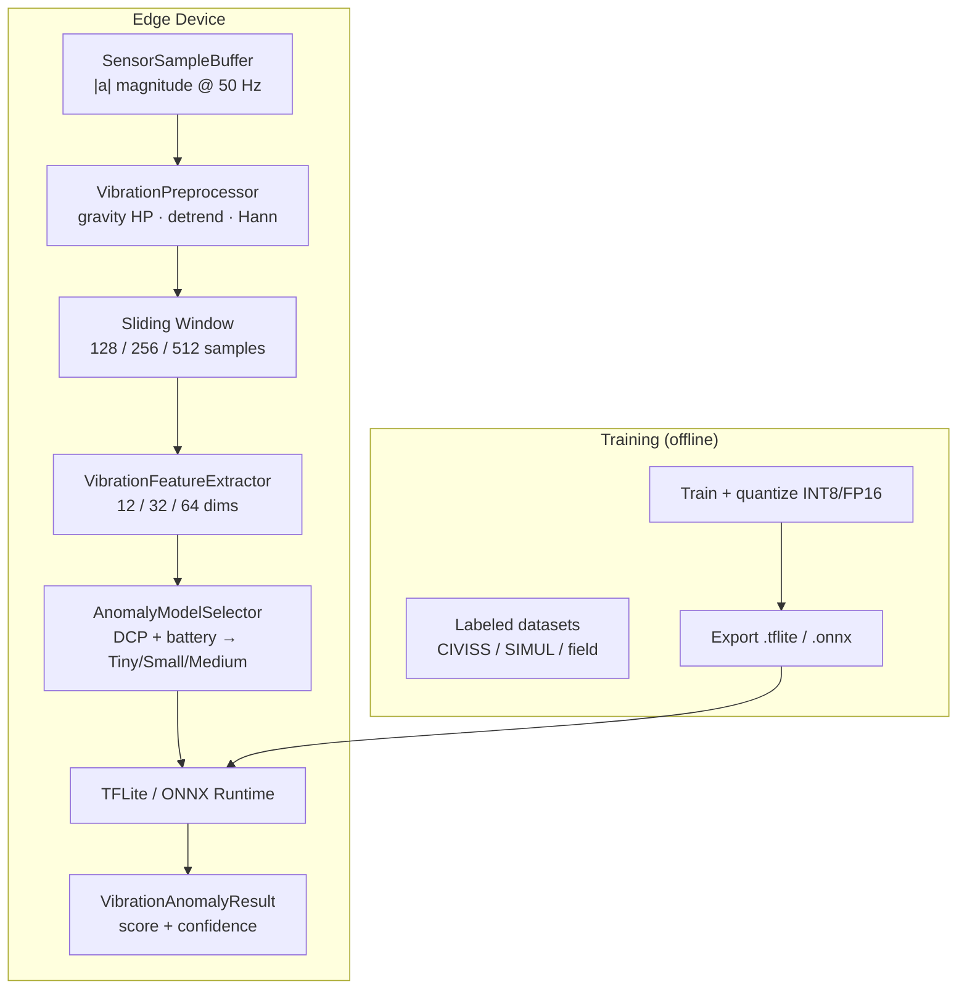

# Edge AI Anomaly Detection Pipeline — Structural Vibration

Complete design for on-device structural vibration anomaly detection, integrated with the Device Capability Profiler (DCP) from `sensing-core`.

---

## 1. Pipeline Architecture



### Stage summary

| Stage | Input | Output | Latency budget |
|-------|-------|--------|----------------|
| **Acquisition** | Raw accel (x,y,z) | `\|a\|` ring buffer | continuous |
| **Preprocessing** | `\|a\|` series | HP-filtered, detrended | < 1 ms |
| **Windowing** | Continuous stream | 128–512 sample windows, 50% overlap | < 0.5 ms |
| **Feature extraction** | Window | 12 / 32 / 64 float vector | 1–8 ms |
| **Inference** | Features (+ optional raw/spec) | anomaly score | 2–40 ms |
| **Post-calibration** | Raw score | confidence (Platt-scaled) | < 0.1 ms |

---

## 2. Preprocessing & Windowing

### 2.1 Gravity / orientation removal

Smartphones rotate; axis components change but structural vibration rides on `\|a\|` after slow drift removal:

```
|a|(t) = sqrt(ax² + ay² + az²)
baseline(t) = α · baseline(t-1) + (1-α) · |a|(t)     α = 0.98
vibration(t) = |a|(t) - baseline(t)
```

### 2.2 Detrend & window function

- Remove linear trend within window (temperature / handling drift)
- Apply Hann window before spectral features

### 2.3 Window parameters (per model)

| Model | Window | Hop | Duration @ 50 Hz | Overlap |
|-------|--------|-----|------------------|---------|
| Tiny | 128 | 64 | 2.56 s | 50% |
| Small | 256 | 128 | 5.12 s | 50% |
| Medium | 512 | 256 | 10.24 s | 50% |

---

## 3. Feature List

### 3.1 Time domain (12) — all models

| # | Feature | Formula | Structural meaning |
|---|---------|---------|-------------------|
| 1 | **RMS** | `sqrt(mean(x²))` | Overall vibration energy |
| 2 | **Peak** | `max(\|x\|)` | Impulsive damage events |
| 3 | **Peak-to-peak** | `max - min` | Amplitude range |
| 4 | **Crest factor** | `peak / RMS` | Impulsiveness (crack, impact) |
| 5 | **Variance** | `σ²` | Signal spread |
| 6 | **Std** | `σ` | Stability measure |
| 7 | **Skewness** | 3rd standardized moment | Asymmetric response |
| 8 | **Kurtosis** | 4th moment − 3 | Tail heaviness (impacts) |
| 9 | **Jerk RMS** | `RMS(Δx)` | Rapid onset (collapse) |
| 10 | **Jerk peak** | `max(\|Δx\|)` | Shock events |
| 11 | **Zero-crossing rate** | crossings / N | Frequency proxy |
| 12 | **Energy** | `Σ x²` | Total window energy |

### 3.2 Frequency domain (10) — Small + Medium

| # | Feature | Bands (Hz) | Meaning |
|---|---------|------------|---------|
| 13–18 | **Band energies** | 0.5–1, 1–2, 2–5, 5–10, 10–20, 20–40 | Modal participation |
| 19 | **Spectral centroid** | — | Dominant frequency region |
| 20 | **Spectral spread** | — | Bandwidth |
| 21 | **Spectral entropy** | — | Randomness vs tonal |
| 22 | **Dominant frequency** | — | Fundamental mode |

### 3.3 Structural proxies (8) — Small + Medium

| # | Feature | Meaning |
|---|---------|---------|
| 23 | Fundamental freq | Building mode estimate |
| 24–25 | Harmonic ratios 2f, 3f | Nonlinear damage indicators |
| 26 | Modal energy ratio | Low/high band split |
| 27 | Decay rate | Material damping change |
| 28 | Q-factor | Resonance sharpness |
| 29 | Impulse factor | `peak / mean(\|x\|)` |
| 30 | Clearance factor | `peak / RMS` variant |

### 3.4 Gyro coupling (6) — Small + Medium

| # | Feature | Meaning |
|---|---------|---------|
| 31–36 | Gyro RMS, peak, accel ratio, band energy, variance, jerk | Rotational coupling during structural failure |

### 3.5 Context (4) — all models (subset for Tiny)

| # | Feature | Meaning |
|---|---------|---------|
| 37 | Sample rate | Normalization metadata |
| 38 | Window duration | Context |
| 39 | Sensor quality (DCP) | Trust weighting |
| 40 | SNR estimate | `RMS / σ_noise` |

### 3.6 Extended (24) — Medium only

Percentiles (p10–p90, IQR), autocorrelation lags, top-10 FFT bins, Haar wavelet energies.

---

## 4. Model Recommendations

### 4.1 Tiny (~15 KB INT8)

```
Input:  [1, 12]  hand-crafted features (normalized)
Arch:   Dense(12→8, ReLU) → Dense(8→1, sigmoid)
Output: anomaly_score ∈ [0, 1]
Train:  Binary CE on feature vectors from windows
Use:    T3_BASIC, CRITICAL battery, 2 GB RAM
Latency: ~2 ms on Snapdragon 450
```

**Pros:** Always-on, negligible battery  
**Cons:** Lower recall on subtle structural drift

### 4.2 Small (~180 KB INT8)

```
Input 0: [1, 32]   feature vector
Input 1: [1, 256]  raw |a| window (1D)
Arch:    1D-CNN(256→64, k=7) ∥ Dense(32→16) → concat → Dense(16→2) → softmax
Output:  [normal_prob, anomaly_prob]
Use:     T2_STANDARD, 3 GB RAM, normal battery
Latency: ~8–15 ms
```

**Pros:** Best accuracy/latency tradeoff for mid-range phones  
**Cons:** Needs 256-sample buffer

### 4.3 Medium (~1.2 MB FP16)

```
Input 0: [1, 64]      features
Input 1: [1, 512]     raw window
Input 2: [1, 32, 16]  log-power spectrogram
Arch:    CNN(512) + CNN2D(32×16) + LSTM(32) → Dense(2)
Output:  [normal_prob, anomaly_prob] + optional uncertainty head
Use:     T1_PREMIUM, ≥ 6 GB RAM, charging or DISASTER mode
Latency: ~25–40 ms
```

**Pros:** Detects subtle modal shifts, best confidence calibration  
**Cons:** Memory; disabled under POWER_SAVE

### 4.4 DCP → Model selection matrix

| Device Tier | RAM | Battery | Accel Quality | → Model |
|-------------|-----|---------|---------------|---------|
| T1_PREMIUM | ≥ 6 GB | NORMAL/DISASTER | ≥ 0.7 | **Medium** |
| T1_PREMIUM | ≥ 4 GB | NORMAL | ≥ 0.5 | **Small** |
| T2_STANDARD | ≥ 3 GB | NORMAL | ≥ 0.4 | **Small** |
| T2/T3 | any | POWER_SAVE | any | **Tiny** |
| any | any | CRITICAL | any | **Tiny** |
| T3_BASIC | ≤ 3 GB | any | < 0.4 | **Tiny** |

---

## 5. Output Contract

```kotlin
data class VibrationAnomalyResult(
    val anomalyScore: Float,    // P(anomaly) — 0..1
    val confidence: Float,      // calibrated certainty — 0..1
    val modelSize: AnomalyModelSize,
    val modelVersion: String,
    val inferenceLatencyMs: Long,
    val isAnomaly: Boolean      // score >= tier-specific threshold
)
```

**Score vs confidence:**
- **Score** = model output (probability of structural anomaly)
- **Confidence** = Platt-scaled distance from decision boundary, penalized by sensor quality and model tier

**Downstream thresholds:**

| Alert level | Score | Confidence | Action |
|-------------|-------|------------|--------|
| Watch | ≥ 0.45 | ≥ 0.5 | Local log only |
| Advisory | ≥ 0.55 | ≥ 0.6 | Queue for upload |
| Warning | ≥ 0.70 | ≥ 0.75 | Immediate mesh broadcast |
| Critical | ≥ 0.85 | ≥ 0.85 | Override power save, anchor on-chain |

---

## 6. Training Strategy

### 6.1 Data sources

| Source | Labels | Use |
|--------|--------|-----|
| **Normal baseline** | Phone on desk, walking, vehicle | Negative class (80%) |
| **SIMUL structural** | SHAKE-S dataset, bridge accel sims | Positive augmentation |
| **Field events** | Post-earthquake citizen uploads (verified) | Positive (sparse) |
| **Synthetic damage** | Modal frequency shift + impulse injection on normal windows | Semi-supervised positive |
| **Negative hard cases** | Construction, trains, wind gusts | Hard negative mining |

### 6.2 Labeling protocol

```
Window label = ANOMALY if ANY of:
  - Verified structural damage within 50 m and ±30 s
  - Dominant freq shift > 15% from building baseline
  - Crest factor > 6 sustained for > 1 s
  - Manual NDRF annotation

Otherwise NORMAL (including walking, traffic)
```

### 6.3 Training pipeline (Python)

```bash
# 1. Extract |a| windows + features (mirror Kotlin extractor in Python)
python training/extract_features.py --input data/raw --out data/features.parquet

# 2. Train three model sizes
python training/train_tiny.py   --features data/features.parquet --out models/tiny/
python training/train_small.py  --features + --windows data/windows.npy --out models/small/
python training/train_medium.py --features + --windows + --spec --out models/medium/

# 3. Quantize
python training/quantize.py --model models/small/saved_model --out models/vibration_anomaly_small_int8.tflite --int8

# 4. Validate on-device latency + accuracy
python training/evaluate_tflite.py --model models/vibration_anomaly_small_int8.tflite --test data/test/
```

### 6.4 Model architecture (Small — reference Keras)

```python
window_in = Input(shape=(256, 1), name="window")
feat_in  = Input(shape=(32,), name="features")

x = Conv1D(16, 7, activation="relu")(window_in)
x = MaxPooling1D(4)(x)
x = Conv1D(32, 5, activation="relu")(x)
x = GlobalMaxPooling1D()(x)

y = Dense(16, activation="relu")(feat_in)

z = Concatenate()([x, y])
z = Dense(16, activation="relu")(z)
out = Dense(2, activation="softmax", name="anomaly")(z)

model = Model(inputs=[window_in, feat_in], outputs=out)
model.compile(optimizer="adam", loss="categorical_crossentropy", metrics=["AUC"])
```

### 6.5 Training hyperparameters

| Param | Tiny | Small | Medium |
|-------|------|-------|--------|
| Optimizer | Adam 1e-3 | Adam 1e-3 | AdamW 5e-4 |
| Batch size | 256 | 128 | 64 |
| Epochs | 50 | 80 | 100 |
| Class weight (anomaly) | 3× | 4× | 5× |
| Augmentation | Gaussian noise σ=0.02 | Time shift ±10 samples | SpecAugment |
| Val split | 20% stratified | 20% by device ID | 20% by location |
| Target AUC | ≥ 0.85 | ≥ 0.92 | ≥ 0.95 |
| False positive rate @ 90% recall | ≤ 8% | ≤ 5% | ≤ 3% |

### 6.6 Quantization

- **Tiny / Small:** Full INT8 post-training quantization (representative dataset = 200 normal + 50 anomaly windows)
- **Medium:** FP16 weights (GPU delegate friendly); optional INT8 for CPU-only path
- Validate ≤ 2% AUC drop after quantization

---

## 7. Inference Flow (Runtime)

```
Every hopSamples / sampleRate seconds:

1. Pull |a| magnitudes from SensorSampleBuffer (≥ windowSamples)
2. VibrationPreprocessor.window()
   → gravity HP → detrend → Hann
3. VibrationFeatureExtractor.extract() → FloatArray[12|32|64]
4. (Small/Medium) attach rawWindow, (Medium) spectrogramPatch
5. TfliteVibrationAnomalyDetector.infer()
   → anomalyScore, confidence
6. If isAnomaly → ObservationEvent("STRUCTURAL_VIBRATION_AI", confidence)
7. Anchor {score, modelVersion, featureHash} off-chain; Merkle root on-chain
```

### Battery-aware model hot-swap

```
onBatteryModeChanged():
  close(currentPipeline)
  pipeline = VibrationAnomalyPipeline(context, report, batteryController)
  // e.g. MEDIUM → TINY when entering POWER_SAVE
```

---

## 8. Kotlin / TFLite Integration

### 8.1 Assets layout

```
src/main/assets/models/
├── vibration_anomaly_tiny_int8.tflite
├── vibration_anomaly_small_int8.tflite
├── vibration_anomaly_medium_fp16.tflite
└── model_manifest.json
```

### 8.2 Usage

```kotlin
// After DCP profiling
val battery = BatteryAwareSamplingController(context)
val pipeline = VibrationAnomalyPipeline(context, dcpReport, battery)

// Inside sensing loop (every 1.28 s for Small @ 50% hop)
val result = pipeline.process(sampleBuffer)
result?.let { r ->
    if (r.isAnomaly && r.confidence >= 0.6f) {
        observationStore.enqueue(
            ObservationEvent(
                eventType = "STRUCTURAL_VIBRATION_AI",
                confidence = r.confidence * r.anomalyScore,
                ...
            )
        )
    }
}
```

### 8.3 Key classes (implemented)

| Class | File |
|-------|------|
| `VibrationAnomalyPipeline` | `ml/VibrationAnomalyPipeline.kt` |
| `VibrationPreprocessor` | `ml/VibrationPreprocessor.kt` |
| `VibrationFeatureExtractor` | `ml/VibrationPreprocessor.kt` |
| `AnomalyModelSelector` | `ml/AnomalyModelSelector.kt` |
| `TfliteVibrationAnomalyDetector` | `ml/TfliteVibrationAnomalyDetector.kt` |

---

## 9. ONNX Runtime Mobile (alternative)

Same tensor shapes; swap detector implementation:

```kotlin
// build.gradle.kts
implementation("com.microsoft.onnxruntime:onnxruntime-android:1.17.0")

// Export from PyTorch/TF:
// torch.onnx.export(model, (feat, window), "vibration_anomaly_small.onnx")
```

Use ONNX when:
- iOS parity needed (CoreML export path from ONNX)
- Custom ops not supported in TFLite
- NNAPI delegate underperforms on target chipset

---

## 10. Evaluation & Monitoring

| Metric | Target | Measure on |
|--------|--------|------------|
| AUC-ROC | ≥ 0.92 (Small) | Held-out field data |
| Latency P95 | ≤ 15 ms (Small) | 10 device matrix |
| Battery drain | ≤ 2%/hr (Small @ 50 Hz) | 8 hr foreground test |
| Model swap downtime | ≤ 200 ms | Battery mode transition |
| Calibration ECE | ≤ 0.08 | Platt scaling on val set |

Log to off-chain telemetry (no PII): `{modelSize, latencyMs, score, confidence, tier, quality}`.

---

## 11. File Layout

```
android/sensing-core/
├── docs/EDGE_AI_VIBRATION_PIPELINE.md     ← this document
├── src/main/java/.../ml/
│   ├── VibrationAnomalyPipeline.kt
│   ├── VibrationPreprocessor.kt
│   ├── AnomalyModelSelector.kt
│   └── TfliteVibrationAnomalyDetector.kt
├── src/main/assets/models/                 ← .tflite files (post-training)
└── training/                               ← Python training scripts (repo root)
    ├── extract_features.py
    ├── train_small.py
    └── quantize.py
```
